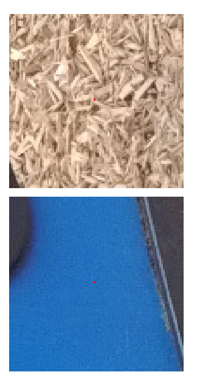
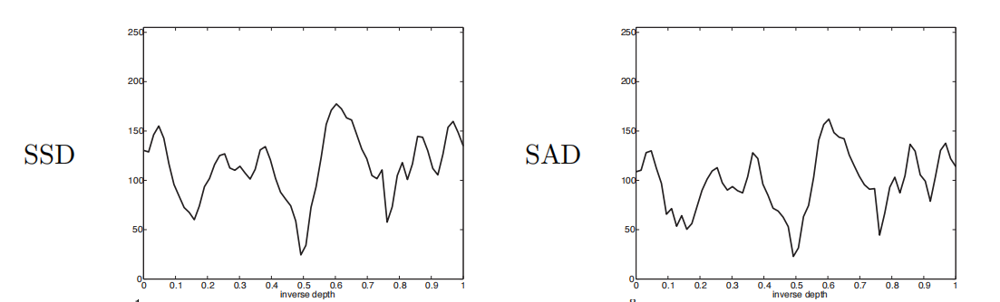
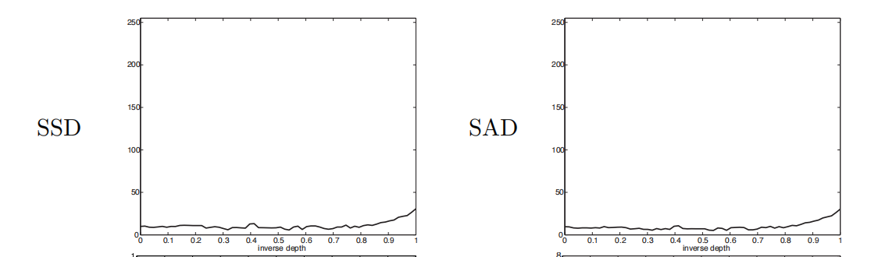

# 问题描述

## 弱纹理（untextured）问题描述
弱纹理一般是指图像中，大块平面，或者纹理的色彩变化不大，辐射强度变化不大的区域。如大片的沙漠，和建筑物的立面。下图中，底部图片是弱纹理图像。

弱纹理会导致MVS在图像一致性度量过程中，无法判断图像一致性，导致匹配点之间的相似度降低。

下图是正常纹理的相似度结果：

弱纹理结果如下：

$$
\rho Ncc(f,g)=\frac{(f-\bar{f})\cdot (g-\bar{g})}{\sigma _{f} \sigma _{g}} \in [-1,1]
$$

如果图像中，弱纹理平面的平均值$ \bar{f} $，此时相似度趋近于0。这就导致弱纹理无法匹配上特征点。